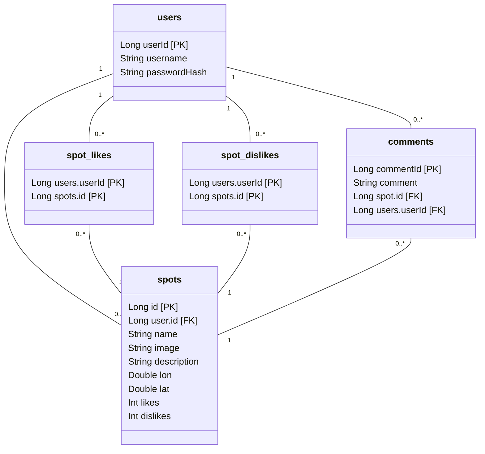

# Backend for spotmap, a React Native app
REST api to handle authentication and database

Frontend: https://github.com/Lauri-Iivarinen/spotmap

# How to run
Don't

# Endpoints

    

        Health check / test
    

## *GET*  -  /api/test

return  : **string** -> "test"

## *GET*  -  /api/test2

return  : **string** -> "test2"

    

        Authentication
    

## *GET*  -  /api/token

**HEADER**  -  Basic auth

return  :  **string**

    

        User
    

## *POST*  -  /newuser

**BODY**  -  

    {
      username: string
      passwordHash: string
    }

return  :  string

## *GET*  -  /api/user

**HEADER**  -  Bearer Token

return  :  JSON  

    {
      id: Long
      userId: Long
      username: string
      role: string
      spots: List
      likes: List
      dislikes :  List
    }

    

        Spot
    

## *GET*  -  /api/spots/{id}

**HEADER**  -  Bearer Token

return  :  JSON 

    {
      id: Long
      name: string
      image: string
      description: string
      lon: double
      lat: double
      likes: int
      dislikes: int
      user: User
      comments: List
    }

## *GET*  -  /api/spots

**HEADER**  -  Bearer Token

return : List<*Spot*> (see above)

## *POST*  -  api/spots

**HEADER**  -  Bearer Token

**BODY**

    {
      name: string
      image: string
      description: string
      lon: double
      lat: double
    }

return  :  JSON 

    {
      id: Long
      name: string
      image: string
      description: string
      lon: double
      lat: double
      likes: int
      dislikes: int
      user: User
      comments: List
    }

##  *POST*  -  api/spots/like/{id}

**HEADER**  -  Bearer Token

return : Spot

##  *POST*  -  api/spots/dislike/{id}

**HEADER**  -  Bearer Token

return : Spot

##  *GET*  -  api/spots/delete/{id}

**HEADER**  -  Bearer Token

return : string

    

        Comments
    

##  *GET*  -  api/comments

**HEADER**  -  Bearer Token

return  :  List<*Comment*>

    Comment:
    {
      comment: string
      user: {
        userId: Long
      }
      spot: {
        id: Long
      }
    }

##  *POST*  -  api/comments

**HEADER**  -  Bearer Token

**BODY**

    {
      comment: string
      user: {
        userId: Long
      }
      spot: {
        id: Long
      }
    }
    
return  : string

# Database

*NOTE* first time using mermaid so there may be errors :)

